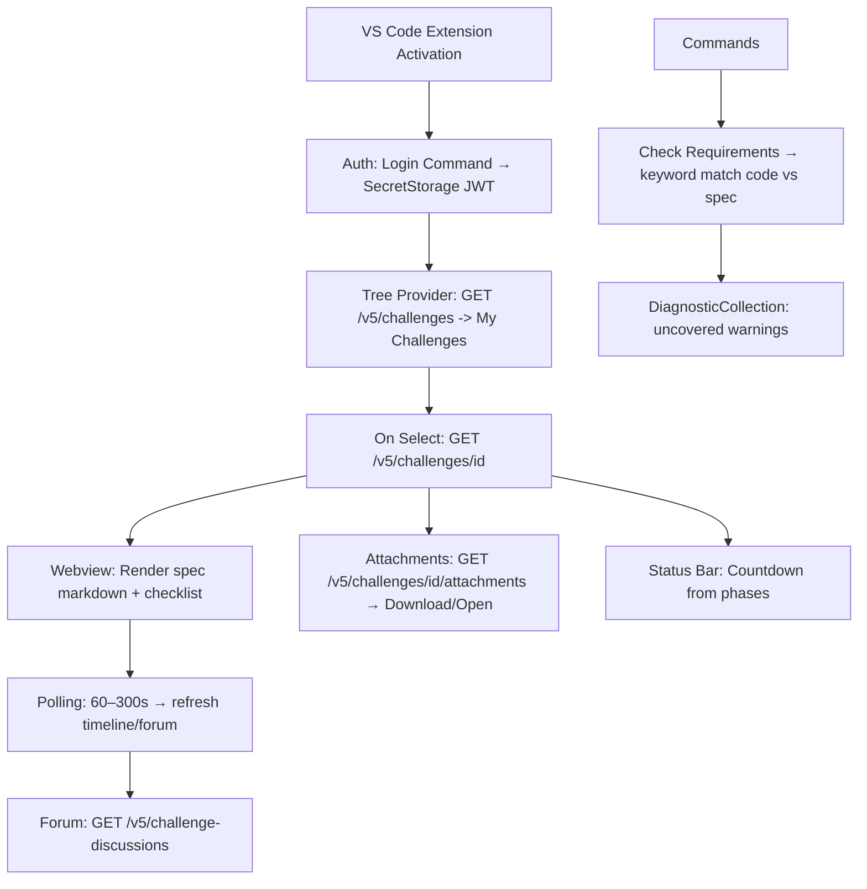
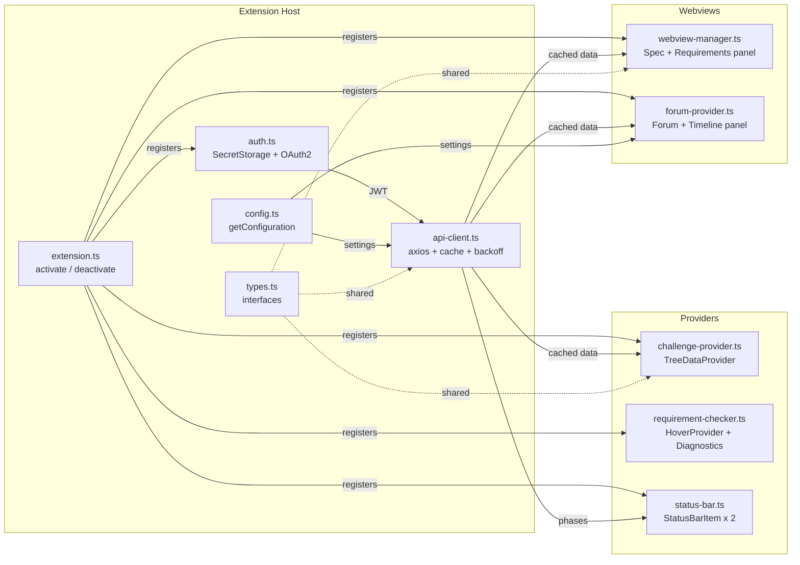
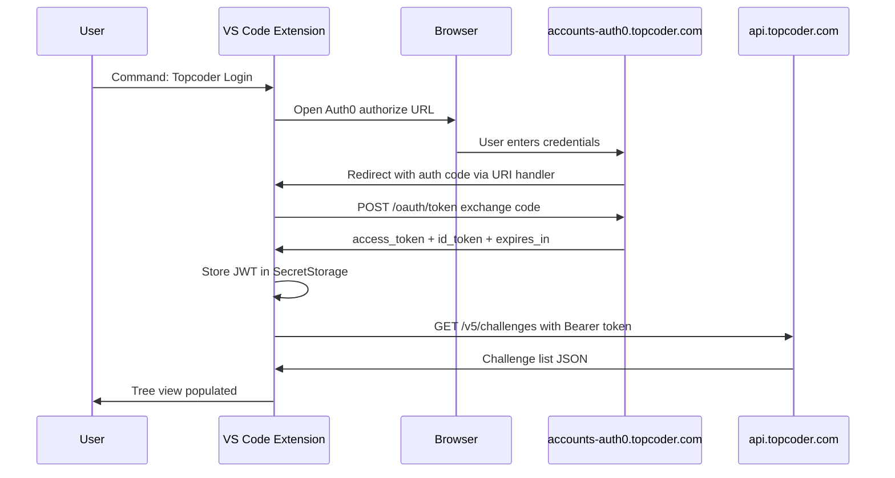

# Architecture — Topcoder VSCode Plugin

> **Scope:** Read-only VS Code extension fetching Topcoder challenge data via existing public v5/v6 APIs. No new endpoints proposed. No write/submit operations (view-only).

---

## 1. High-Level Flow



---

## 2. Component Architecture



---

## 3. Module Breakdown

| Module | Responsibility | Key Exports |
|--------|---------------|-------------|
| `extension.ts` | Entry point. Registers all commands, providers, and views in `activate()`. Pushes all disposables to `context.subscriptions`. | `activate()`, `deactivate()` |
| `auth.ts` | OAuth2 device/browser flow. Stores JWT in `context.secrets`. Decodes token for handle/userId. Detects expiry. | `AuthService` class |
| `api-client.ts` | Centralized HTTP client (axios). Attaches `Authorization: Bearer` header. Implements caching (globalState + TTL), retry logic (3 retries, exponential backoff), and `CancellationToken` support. | `ApiClient` class |
| `config.ts` | Reads `workspace.getConfiguration('topcoder')`. Validates and exposes typed settings. | `getConfig()` helper |
| `types.ts` | TypeScript interfaces: `Challenge`, `Phase`, `Attachment`, `Discussion`, `Submission`, `Requirement`, `CacheEntry<T>`. | Type-only exports |
| `challenge-provider.ts` | `TreeDataProvider<ChallengeTreeItem>`. Fetches challenge list, builds tree nodes with children (Spec, Requirements, Attachments, Forum, Timeline). | `ChallengeProvider` class |
| `webview-manager.ts` | Creates/manages the Spec Webview panel. Renders markdown via `markdown-it`, sanitizes HTML, handles `postMessage` commands (refresh, copy, toggle checkbox). | `WebviewManager` class |
| `status-bar.ts` | Creates two `StatusBarItem` instances (countdown + requirements counter). Updates countdown every 60s. Color-codes by urgency. | `StatusBarManager` class |
| `requirement-checker.ts` | Parses spec into requirement items. Keyword extraction. Workspace file scanning. Registers `HoverProvider`. Manages `DiagnosticCollection` and `TextEditorDecorationType`. | `RequirementChecker` class |
| `forum-provider.ts` | Creates/manages the Forum & Timeline Webview. Fetches discussions. Renders post cards. Manages auto-poll interval. Handles pagination. | `ForumProvider` class |

---

## 4. API Specification Table

All endpoints are existing public Topcoder APIs. **No new endpoints required.**

| # | Purpose | Method | Endpoint | Query Params | Auth | Response Fields Used | Caching |
|---|---------|--------|----------|-------------|------|---------------------|---------|
| 1 | **List active challenges** | `GET` | `/v5/challenges` | `status=Active`, `memberHandle={handle}`, `sortBy=updated`, `sortOrder=desc`, `perPage=50` | `Bearer {JWT}` | `id`, `name`, `status`, `numOfRegistrants`, `numOfSubmissions`, `tags[]`, `prizeSets[]` | `globalState`, TTL: 5 min |
| 2 | **Get challenge details** | `GET` | `/v5/challenges/{challengeId}` | — | `Bearer {JWT}` | `id`, `name`, `description` (markdown spec), `status`, `phases[]`, `prizeSets[]`, `tags[]`, `legacy.track`, `metadata` | `globalState`, TTL: 5 min |
| 3 | **List attachments** | `GET` | `/v5/challenges/{challengeId}/attachments` | — | `Bearer {JWT}` | `id`, `name`, `url`, `fileType`, `size` | `globalState`, TTL: 10 min |
| 4 | **List resources (roles)** | `GET` | `/v5/resources` | `challengeId={id}` | `Bearer {JWT}` | `memberId`, `memberHandle`, `roleId` (to verify registration) | `globalState`, TTL: 10 min |
| 5 | **Get forum discussions** | `GET` | `/v5/challenge-discussions` | `challengeId={id}`, `perPage=20`, `page=1`, `sortBy=createdAt`, `sortOrder=desc` | `Bearer {JWT}` | `id`, `challengeId`, `body`, `authorHandle`, `authorRole`, `createdAt` | `globalState`, TTL: 60s |
| 6 | **Get submission history** | `GET` | `/v5/submissions` | `challengeId={id}`, `memberId={userId}`, `perPage=10` | `Bearer {JWT}` | `id`, `type`, `url`, `createdAt`, `status` | `globalState`, TTL: 5 min |
| 7 | **Get member profile** | `GET` | `/v5/members/{handle}` | — | `Bearer {JWT}` | `handle`, `photoURL`, `skills[]` (for login info display) | `globalState`, TTL: 30 min |
| 8 | **Authenticate (token)** | `POST` | `https://accounts-auth0.topcoder.com/oauth/token` | Body: `grant_type`, `client_id`, `scope`, `audience` (or device code flow params) | None (generates token) | `access_token`, `id_token`, `expires_in`, `token_type` | `SecretStorage` (persistent) |

### Base URLs

| Environment | Base URL |
|-------------|----------|
| Production | `https://api.topcoder.com` |
| Development | `https://api.topcoder-dev.com` |
| Auth (Production) | `https://accounts-auth0.topcoder.com` |

> **All endpoints are existing and documented.** The extension makes no mutations — all calls are `GET` (read-only) except the initial `POST` for authentication.

---

## 5. Authentication Flow



### Token Management
- **Storage:** `context.secrets.store('topcoder.jwt', token)` — encrypted, OS-level keychain.
- **Retrieval:** `context.secrets.get('topcoder.jwt')` — called by `ApiClient` before each request.
- **Expiry Detection:** Decode JWT payload, check `exp` claim against `Date.now()`. If expired or within 5 min of expiry, prompt re-login via `showWarningMessage`.
- **401 Handling:** `ApiClient` intercepts 401 responses → clears stored JWT → shows "Session expired. Please log in again." → triggers login command.
- **Logout:** `context.secrets.delete('topcoder.jwt')` → clear all cached data → reset tree view.

---

## 6. Security

### Webview Content Security Policy
Every webview includes this CSP in the `<meta>` tag:

```html
<meta http-equiv="Content-Security-Policy" 
      content="default-src 'none'; 
               style-src ${webview.cspSource}; 
               script-src 'nonce-${nonce}'; 
               img-src ${webview.cspSource} https:; 
               font-src ${webview.cspSource};">
```

### Security Checklist

| Concern | Mitigation |
|---------|-----------|
| Token exposure | Store in `SecretStorage` only. Never in `globalState`, settings, or logs. |
| XSS in webviews | Sanitize all HTML with `sanitize-html`. Strict CSP. Nonce-based `<script>` tags only. |
| Resource access | `localResourceRoots` restricted to extension's `media/` and `dist/` directories. |
| Logging | Custom `OutputChannel` for debug info. JWT values are redacted: `Bearer ***` in logs. |
| API abuse | Rate limit detection (HTTP 429) → exponential backoff (base 2s, max 60s, 3 retries). |
| Man-in-middle | All API calls over HTTPS. No HTTP fallback. |
| Extension permissions | Minimal activation events. No file system write access required. |
| Cancellation | All async API calls accept `CancellationToken`. Aborted on user action or timeout. |

---

## 7. Performance

### Caching Strategy

```typescript
interface CacheEntry<T> {
  data: T;
  expiresAt: number; // Date.now() + ttlMs
}

async function getCachedOrFetch<T>(
  key: string,
  fetcher: (token: CancellationToken) => Promise<T>,
  ttlMs: number,
  globalState: vscode.Memento,
  token: CancellationToken
): Promise<T> {
  const cached = globalState.get<CacheEntry<T>>(key);
  if (cached && cached.expiresAt > Date.now()) {
    return cached.data;
  }
  const data = await fetcher(token);
  await globalState.update(key, { data, expiresAt: Date.now() + ttlMs });
  return data;
}
```

### TTL Configuration

| Data Type | Cache Key Pattern | Default TTL | Configurable |
|-----------|-------------------|-------------|-------------|
| Challenge list | `tc.cache.list` | 5 min | No |
| Challenge detail | `tc.cache.detail.{id}` | 5 min | No |
| Attachments | `tc.cache.attach.{id}` | 10 min | No |
| Forum posts | `tc.cache.forum.{id}` | 60s | Via `pollInterval` |
| Member profile | `tc.cache.member.{handle}` | 30 min | No |

### Polling

- Forum/timeline auto-refresh: configurable interval (`topcoder.pollInterval`), default 120s, range 60–300s.
- Status bar countdown: UI-only timer (`setInterval` 60s), no API call — uses cached phase dates.
- Tree view: manual refresh only (no auto-poll) to minimize API calls.
- All intervals stored as disposable references, cleared in `deactivate()` and on logout.

### Lazy Activation

```jsonc
// package.json
{
  "activationEvents": [
    "onStartupFinished"
  ]
}
```

The extension activates after VS Code finishes loading. No blocking `onStartup` or `*` activation. Tree data is fetched only when the Topcoder sidebar is first opened (lazy on view visibility).

---

## 8. Error Handling

| Scenario | Detection | Response |
|----------|-----------|----------|
| Network failure | `axios` error `ERR_NETWORK` / timeout | `showErrorMessage("Cannot reach Topcoder API. Check your connection.")`. Queue retry. |
| HTTP 401 Unauthorized | Response status 401 | Clear stored JWT. `showWarningMessage("Session expired...")`. Trigger `topcoder.login` command. |
| HTTP 403 Forbidden | Response status 403 | `showErrorMessage("Access denied. You may not be registered for this challenge.")` |
| HTTP 429 Rate Limited | Response status 429 + `Retry-After` header | Exponential backoff: wait `min(2^attempt * 2000, 60000)` ms. Max 3 retries. Show progress notification during wait. |
| HTTP 5xx Server Error | Response status 500–599 | `showErrorMessage("Topcoder API error. Try again later.")`. Log status + URL to output channel. |
| Invalid/corrupt JWT | JWT decode fails or `exp` < now | Clear stored JWT. Prompt re-login. |
| Empty challenge list | 200 response with empty array | Show tree view message: "No active challenges found. Make sure you are registered." |
| Forum API unavailable | 404 or specific error code | Graceful degradation: hide forum section, show "Discussions not available for this challenge." |
| Large spec body | Description > 500 KB | Truncate with "Show full spec in browser" link. Prevents webview performance issues. |
| Extension crash | Unhandled rejection | Global `process.on('unhandledRejection')` logs to output channel. No user-facing crash. |

---

## 9. Data Flow Summary

| User Action | Extension Host | API Call | UI Update |
|------------|---------------|----------|-----------|
| Login | `AuthService.login()` | `POST auth0/oauth/token` | Tree: show challenges |
| Select challenge | `ApiClient.getDetail()` | `GET /v5/challenges/{id}` | Status bar, expand tree |
| Open spec | `WebviewManager.show()` | (cached from above) | Webview: rendered spec |
| Toggle checkbox | `workspaceState.update()` | (none — local only) | Counter: 6/8 |
| Download attachment | `env.openExternal()` | `GET /v5/.../attachments` | Browser opens download |
| Refresh | `ApiClient.getList()` | `GET /v5/challenges` | Tree: updated list |
| Check requirements | `RequirementChecker` | (none — workspace scan) | Diagnostics, decorations |
| View forum | `ForumProvider.show()` | `GET /v5/challenge-discussions` | Webview: post cards |
| Auto-poll tick | `ForumProvider.poll()` | `GET /v5/challenge-discussions` | Badge count, new posts |

---

## 10. API Verification Appendix

> **Purpose:** Provides authoritative source references, verified parameter names, and representative sample response payloads for every API endpoint used by this extension. Eliminates ambiguity between documents.

### Canonical Base URLs

| Environment | API Base | Auth Base | Source |
|-------------|----------|-----------|--------|
| Production | `https://api.topcoder.com` | `https://accounts-auth0.topcoder.com` | [Topcoder API Docs](https://topcoder-platform.github.io/tc-api-docs/) |
| Development | `https://api.topcoder-dev.com` | `https://accounts-auth0.topcoder-dev.com` | — |

---

### EP-1: List Active Challenges

| Field | Value |
|-------|-------|
| **Method** | `GET` |
| **URL** | `{baseUrl}/v5/challenges` |
| **Auth** | `Authorization: Bearer {JWT}` |
| **Query Params** | `status=Active`, `memberHandle={handle}`, `sortBy=updated`, `sortOrder=desc`, `perPage=50` |
| **Source** | [challenges-api v5](https://github.com/topcoder-platform/challenge-api) |

<details>
<summary>Sample Response (truncated)</summary>

```json
[
  {
    "id": "a5ad9e6f-5e08-4261-ac6e-40b3967fa0d9",
    "name": "TC VSCode Plugin Ideation",
    "status": "Active",
    "track": "First2Finish",
    "type": "First2Finish",
    "numOfRegistrants": 24,
    "numOfSubmissions": 3,
    "tags": ["TypeScript", "VS Code"],
    "prizeSets": [
      {
        "type": "placement",
        "prizes": [{ "value": 800, "type": "USD" }]
      }
    ],
    "phases": [
      {
        "name": "Registration",
        "phaseStatus": "Closed",
        "scheduledStartDate": "2026-02-28T00:00:00Z",
        "scheduledEndDate": "2026-03-02T00:00:00Z"
      },
      {
        "name": "Submission",
        "phaseStatus": "Open",
        "scheduledStartDate": "2026-03-02T00:00:00Z",
        "scheduledEndDate": "2026-03-06T14:00:00Z"
      }
    ],
    "currentPhaseNames": ["Submission"],
    "updated": "2026-03-04T08:32:00Z"
  }
]
```
</details>

**Field → UI Mapping:**

| Response Field | UI Element | View |
|---------------|-----------|------|
| `name` | Tree node label | WF1: Explorer |
| `status` | Badge text (`Active` / `Upcoming`) | WF1: Explorer |
| `numOfRegistrants` | Registrants child node count | WF1: Explorer |
| `numOfSubmissions` | Submissions child node count | WF1: Explorer |
| `tags[]` | Tag pills on dashboard card | Extras: Dashboard |
| `prizeSets[0].prizes[0].value` | Prize display ("$800") | WF2: Spec, Dashboard |
| `phases[]` | Timeline segments | WF3: Status bar, WF6: Timeline |
| `currentPhaseNames[0]` | Status bar phase label | WF3: Status bar |

---

### EP-2: Get Challenge Details

| Field | Value |
|-------|-------|
| **Method** | `GET` |
| **URL** | `{baseUrl}/v5/challenges/{challengeId}` |
| **Auth** | `Authorization: Bearer {JWT}` |
| **Query Params** | — |
| **Source** | [challenges-api v5](https://github.com/topcoder-platform/challenge-api) |

<details>
<summary>Sample Response (truncated)</summary>

```json
{
  "id": "a5ad9e6f-5e08-4261-ac6e-40b3967fa0d9",
  "name": "TC VSCode Plugin Ideation",
  "description": "## Challenge Overview\nDesign a VS Code extension that integrates with Topcoder APIs...\n\n## Requirements\n1. **Wireframes** — provide annotated wireframes for all key screens...\n2. **Glossary** — define all UI elements...",
  "privateDescription": null,
  "status": "Active",
  "phases": [
    {
      "id": "phase-001",
      "name": "Registration",
      "phaseStatus": "Closed",
      "duration": 345600000,
      "scheduledStartDate": "2026-02-28T00:00:00Z",
      "scheduledEndDate": "2026-03-02T00:00:00Z",
      "actualStartDate": "2026-02-28T00:00:00Z",
      "actualEndDate": "2026-03-02T00:00:00Z"
    },
    {
      "id": "phase-002",
      "name": "Submission",
      "phaseStatus": "Open",
      "duration": 345600000,
      "scheduledStartDate": "2026-03-02T00:00:00Z",
      "scheduledEndDate": "2026-03-06T14:00:00Z"
    }
  ],
  "prizeSets": [
    {
      "type": "placement",
      "prizes": [{ "value": 800, "type": "USD" }]
    }
  ],
  "tags": ["TypeScript", "VS Code"],
  "metadata": [],
  "legacy": { "track": "FIRST_2_FINISH" }
}
```
</details>

**Field → UI Mapping:**

| Response Field | UI Element | View |
|---------------|-----------|------|
| `description` | Rendered markdown body | WF2: Spec webview |
| `phases[].name` | Phase segment label | WF6: Timeline bar |
| `phases[].phaseStatus` | Phase color coding (green/yellow/gray) | WF6: Timeline |
| `phases[].scheduledEndDate` | Countdown timer source | WF3: Status bar |
| `prizeSets` | Prize display in spec header | WF2: Spec toolbar |
| `tags[]` | Tech tags in spec header | WF2: Spec toolbar |

---

### EP-3: List Attachments

| Field | Value |
|-------|-------|
| **Method** | `GET` |
| **URL** | `{baseUrl}/v5/challenges/{challengeId}/attachments` |
| **Auth** | `Authorization: Bearer {JWT}` |
| **Query Params** | — |
| **Source** | [challenges-api v5](https://github.com/topcoder-platform/challenge-api) |

<details>
<summary>Sample Response</summary>

```json
[
  {
    "id": "att-001",
    "name": "data-model.pdf",
    "url": "https://s3.amazonaws.com/topcoder-challenges/att-001/data-model.pdf",
    "fileSize": 245760,
    "challengeId": "a5ad9e6f-5e08-4261-ac6e-40b3967fa0d9"
  },
  {
    "id": "att-002",
    "name": "sample-data.sql",
    "url": "https://s3.amazonaws.com/topcoder-challenges/att-002/sample-data.sql",
    "fileSize": 12048,
    "challengeId": "a5ad9e6f-5e08-4261-ac6e-40b3967fa0d9"
  }
]
```
</details>

**Field → UI Mapping:**

| Response Field | UI Element | View |
|---------------|-----------|------|
| `name` | Attachment label | WF2: Attachments section |
| `url` | Download target (`env.openExternal`) | WF2: Click action |
| `fileSize` | Size display (formatted bytes) | WF2: Attachment description |

---

### EP-4: List Resources (Registrants)

| Field | Value |
|-------|-------|
| **Method** | `GET` |
| **URL** | `{baseUrl}/v5/resources` |
| **Auth** | `Authorization: Bearer {JWT}` |
| **Query Params** | `challengeId={id}` |
| **Source** | [resources-api v5](https://github.com/topcoder-platform/resources-api) |

<details>
<summary>Sample Response (truncated)</summary>

```json
[
  {
    "id": "res-001",
    "challengeId": "a5ad9e6f-5e08-4261-ac6e-40b3967fa0d9",
    "memberId": "40309246",
    "memberHandle": "mirzailhami",
    "roleId": "732339e7-8e30-49d7-9571-cb47c4bef26d",
    "created": "2026-03-01T10:15:00Z"
  },
  {
    "id": "res-002",
    "challengeId": "a5ad9e6f-5e08-4261-ac6e-40b3967fa0d9",
    "memberId": "22688726",
    "memberHandle": "copilot_sarah",
    "roleId": "cfe12b3f-2a24-4639-9d45-b5f5c254b438",
    "created": "2026-02-28T08:00:00Z"
  }
]
```
</details>

**Field → UI Mapping:**

| Response Field | UI Element | View |
|---------------|-----------|------|
| `memberHandle` | Registrant list / user verification | WF1: Registrants node |
| `roleId` | Role badge (Copilot / Submitter) | WF6: Forum post role |
| `memberId` | Match against logged-in user (registration check) | Internal logic |

---

### EP-5: Get Forum Discussions

| Field | Value |
|-------|-------|
| **Method** | `GET` |
| **URL** | `{baseUrl}/v5/challenge-discussions` |
| **Auth** | `Authorization: Bearer {JWT}` |
| **Query Params** | `challengeId={id}`, `perPage=20`, `page=1`, `sortBy=createdAt`, `sortOrder=desc` |
| **Source** | [discussions-api v5](https://github.com/topcoder-platform/challenge-api) |

<details>
<summary>Sample Response (truncated)</summary>

```json
[
  {
    "id": "disc-012",
    "challengeId": "a5ad9e6f-5e08-4261-ac6e-40b3967fa0d9",
    "body": "Clarification: Rate limiting should be per-IP, not per-user. Please update REQ-4 accordingly.",
    "authorHandle": "copilot_sarah",
    "authorRole": "Copilot",
    "createdAt": "2026-03-04T06:15:00Z",
    "updatedAt": "2026-03-04T06:15:00Z"
  },
  {
    "id": "disc-011",
    "challengeId": "a5ad9e6f-5e08-4261-ac6e-40b3967fa0d9",
    "body": "Q: Should the JWT tokens use RS256 or HS256?",
    "authorHandle": "dev_mike",
    "authorRole": "Submitter",
    "createdAt": "2026-03-04T03:30:00Z",
    "updatedAt": "2026-03-04T03:30:00Z"
  }
]
```
</details>

**Field → UI Mapping:**

| Response Field | UI Element | View |
|---------------|-----------|------|
| `body` | Post content text | WF6: Forum post card |
| `authorHandle` | Author name display | WF6: Forum post header |
| `authorRole` | Role badge (Copilot / Member) | WF6: Forum post header |
| `createdAt` | Relative timestamp ("2h ago") | WF6: Forum post header |

---

### EP-6: Get Submission History

| Field | Value |
|-------|-------|
| **Method** | `GET` |
| **URL** | `{baseUrl}/v5/submissions` |
| **Auth** | `Authorization: Bearer {JWT}` |
| **Query Params** | `challengeId={id}`, `memberId={userId}`, `perPage=10` |
| **Source** | [submissions-api v5](https://github.com/topcoder-platform/submissions-api) |

<details>
<summary>Sample Response (truncated)</summary>

```json
[
  {
    "id": "sub-002",
    "challengeId": "a5ad9e6f-5e08-4261-ac6e-40b3967fa0d9",
    "memberId": "40309246",
    "type": "Contest Submission",
    "url": "https://s3.amazonaws.com/submissions/sub-002.zip",
    "created": "2026-03-04T02:10:00Z",
    "updated": "2026-03-04T02:10:00Z",
    "legacySubmissionId": 220345
  },
  {
    "id": "sub-001",
    "challengeId": "a5ad9e6f-5e08-4261-ac6e-40b3967fa0d9",
    "memberId": "40309246",
    "type": "Contest Submission",
    "url": "https://s3.amazonaws.com/submissions/sub-001.zip",
    "created": "2026-03-03T18:45:00Z",
    "updated": "2026-03-03T18:45:00Z",
    "legacySubmissionId": 220310
  }
]
```
</details>

**Field → UI Mapping:**

| Response Field | UI Element | View |
|---------------|-----------|------|
| `type` | Submission type label | WF2: Submission history |
| `created` | Timestamp display | WF2: Submission history |
| `url` | Download link | WF2: Click action |
| Array length | Submissions count ("3 submitted") | WF1: Submissions node |

---

### EP-7: Get Member Profile

| Field | Value |
|-------|-------|
| **Method** | `GET` |
| **URL** | `{baseUrl}/v5/members/{handle}` |
| **Auth** | `Authorization: Bearer {JWT}` |
| **Query Params** | — |
| **Source** | [member-api v5](https://github.com/topcoder-platform/member-api) |

<details>
<summary>Sample Response (truncated)</summary>

```json
{
  "userId": 40309246,
  "handle": "mirzailhami",
  "firstName": "Mirza",
  "lastName": "Ilhami",
  "photoURL": "https://topcoder-dev-media.s3.amazonaws.com/member/profile/mirzailhami.jpg",
  "competitionCountryCode": "ID",
  "skills": [
    { "name": "TypeScript", "score": 95 },
    { "name": "Node.js", "score": 90 }
  ],
  "createdAt": "2020-06-15T00:00:00Z"
}
```
</details>

**Field → UI Mapping:**

| Response Field | UI Element | View |
|---------------|-----------|------|
| `handle` | Login display ("Logged in as: mirzailhami") | WF1: Sidebar footer |
| `photoURL` | Avatar (if rendered) | WF6: Forum posts |
| `userId` | Internal ID for submissions/resource queries | Internal logic |

---

### EP-8: Authenticate (OAuth Token)

| Field | Value |
|-------|-------|
| **Method** | `POST` |
| **URL** | `https://accounts-auth0.topcoder.com/oauth/token` |
| **Auth** | None (this generates the token) |
| **Body** | `{ "grant_type": "authorization_code", "client_id": "{app_client_id}", "code": "{auth_code}", "redirect_uri": "{vscode_uri_handler}", "scope": "openid profile email" }` |
| **Source** | [Auth0 Authorization Code Flow](https://auth0.com/docs/get-started/authentication-and-authorization-flow/authorization-code-flow) |

<details>
<summary>Sample Response</summary>

```json
{
  "access_token": "eyJhbGciOiJSUzI1NiIs...truncated",
  "id_token": "eyJhbGciOiJSUzI1NiIs...truncated",
  "token_type": "Bearer",
  "expires_in": 86400,
  "scope": "openid profile email"
}
```
</details>

**Field → UI Mapping:**

| Response Field | UI Element | View |
|---------------|-----------|------|
| `access_token` | Stored in `SecretStorage`, used for all API calls | Internal (auth.ts) |
| `id_token` | Decoded for `handle`, `userId` | WF1: Login display |
| `expires_in` | Proactive re-login prompt (5 min before expiry) | Internal (auth.ts) |

---

### Cross-Document Parameter Normalization

> **Canonical parameter names** used consistently across all documents:

| Parameter | Canonical Name | Used In |
|-----------|---------------|---------|
| Member filter (challenges) | `memberHandle={handle}` | EP-1 |
| Member filter (submissions) | `memberId={userId}` | EP-6 |
| Challenge reference | `challengeId={id}` | EP-3, EP-4, EP-5, EP-6 |
| Pagination | `perPage={n}`, `page={n}` | EP-1, EP-5, EP-6 |
| Sort | `sortBy={field}`, `sortOrder=desc` | EP-1, EP-5 |
| Auth header | `Authorization: Bearer {JWT}` | EP-1 through EP-7 |
