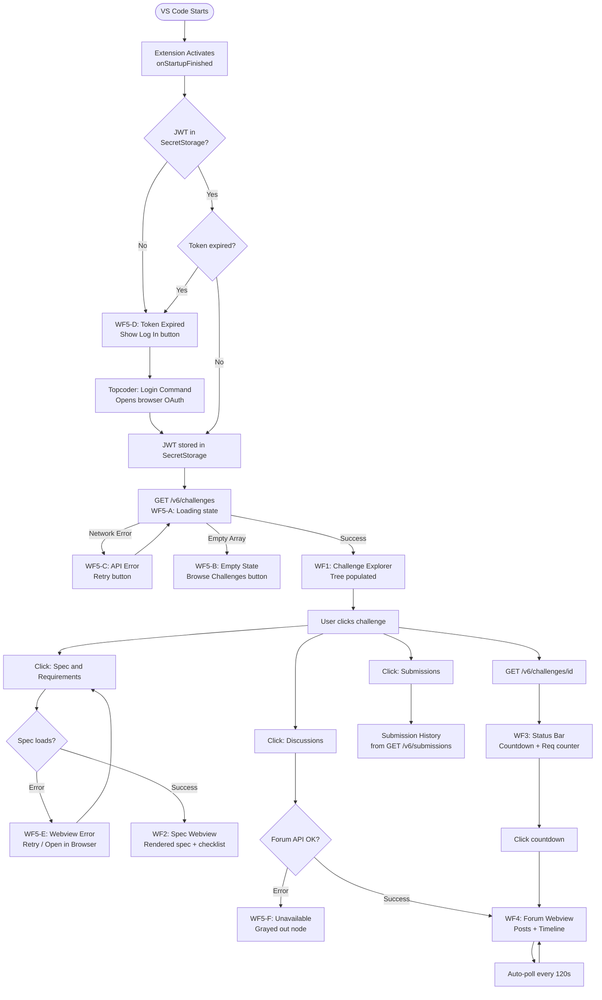

# Wireframes — Topcoder VSCode Plugin

> **Format:** Each wireframe is provided as an **Excalidraw sketch** (visual) alongside a **text-based layout** (accessible reference). Open the `.excalidraw` files in VS Code with the [Excalidraw extension](https://marketplace.visualstudio.com/items?itemName=pomdtr.excalidraw-editor) for the best visual experience.  
> **Convention:** `[ ]` = button/action, `[x]` = checkbox checked, `$(icon)` = VS Code Codicon reference, `───` = separator.

### Visual Wireframe Files

| # | Wireframe | Excalidraw File |
|---|-----------|-----------------|
| WF1 | Activity Bar & Challenge Explorer | [`wireframes/WF1-challenge-explorer.excalidraw`](wireframes/WF1-challenge-explorer.excalidraw) |
| WF2 | Spec & Requirements Webview | [`wireframes/WF2-spec-webview.excalidraw`](wireframes/WF2-spec-webview.excalidraw) |
| WF3 | Status Bar Countdown | [`wireframes/WF3-status-bar.excalidraw`](wireframes/WF3-status-bar.excalidraw) |
| WF4 | Forum & Timeline Sidebar | [`wireframes/WF4-forum-timeline.excalidraw`](wireframes/WF4-forum-timeline.excalidraw) |
| WF5 | Edge States (Loading / Empty / Error / Token Expired) | [`wireframes/WF5-edge-states.excalidraw`](wireframes/WF5-edge-states.excalidraw) |

---

## End-to-End User Flow

The following flow map traces primary user journeys through all wireframes, including edge states:



### Flow Notes
- **Happy path:** START → Token OK → Tree → Select → Spec / Forum / Submissions
- **Auth failure path:** Token missing/expired → Login prompt → Re-authenticate → Tree
- **Network failure path:** Any API call → Error state → Retry → Recover
- **Graceful degradation:** Forum unavailable → other features continue working

## WF1: Activity Bar & Challenge Explorer (Tier A)

This wireframe shows the primary entry point — a new "Topcoder" icon in the Activity Bar that opens a tree-based sidebar for browsing active challenges.

```
┌─────────────────────────────────────────────────────────────────────┐
│  ACTIVITY BAR          │  SIDEBAR (Topcoder)                       │
│  ┌──────┐              │                                           │
│  │ 📁   │ Explorer     │  MY ACTIVE CHALLENGES          [$(refresh)]│
│  │ 🔍   │ Search       │  ─────────────────────────────────────────│
│  │ 🔀   │ Source Ctrl  │  ▶ $(trophy) TC VSCode Plugin     [Active]│
│  │ 🐛   │ Run/Debug    │  ▼ $(trophy) RFP Proposal BE     [Active]│
│  │ 🧩   │ Extensions   │  │  ├── $(book)    Spec & Requirements    │
│  │      │              │  │  ├── $(comment) Discussions (12)       │
│  │ ┌──┐ │              │  │  ├── $(cloud-upload) Submissions       │
│  │ │TC│ │ ◀ TOPCODER   │  │  ├── $(person)  Registrants (24)      │
│  │ └──┘ │   (active)   │  │  └── $(clock)  Timeline                │
│  │      │              │  ▶ $(trophy) RFP Proposal UI   [Upcoming]│
│  └──────┘              │                                           │
│                        │  ─────────────────────────────────────────│
│                        │  $(info) Logged in as: mirzailhami       │
├────────────────────────┴───────────────────────────────────────────┤
│  STATUS BAR                                                        │
│  $(clock) TC: Submission ends in 4h 12m  │  $(check) 5/8 reqs     │
└─────────────────────────────────────────────────────────────────────┘
```

### Annotations
- **Activity Bar Icon ("TC"):** Custom Topcoder icon registered via `viewsContainers.activitybar` in `package.json`. Activates the Topcoder sidebar on click.
- **Tree Nodes:** Each challenge is a collapsible `TreeItem` with `label` = challenge name and `description` = status badge (`ACTIVE`, `DRAFT`). Status badge uses `TreeItemLabel` with highlight color.
- **Child Nodes:** Five fixed children per challenge: Spec & Requirements, Discussions, Submissions, Registrants, Timeline. Each has a contextual icon (`$(book)`, `$(comment)`, `$(cloud-upload)`, `$(person)`, `$(clock)`) and shows a count where applicable.
- **Refresh Button:** Inline toolbar action on the tree view header. Triggers `GET /v6/challenges` re-fetch.
- **Login Info:** Footer section in sidebar showing current handle, sourced from the decoded JWT stored in `SecretStorage`.
- **Status Bar Items:** Two items — countdown timer (left-aligned, priority 100) and requirements progress (right-aligned, priority 50). Both are `StatusBarItem` instances disposed on deactivation.

---

## WF2: Spec & Requirements Webview Panel (Tier A)

Opens when the user clicks "Spec & Requirements" in the tree. A full-width editor-tab webview rendering the challenge specification with interactive requirements.

```
┌─────────────────────────────────────────────────────────────────────┐
│  TAB BAR                                                            │
│  [extension.ts]  [index.html]  [$(book) API Microservice Spec ✕]   │
├─────────────────────────────────────────────────────────────────────┤
│  TOOLBAR                                                            │
│  [$(refresh) Refresh]  [$(files) Attachments]  [$(clippy) Copy Spec]│
│                                                         [$(link-external) Open in Browser]│
├─────────────────────────────────────────────────────────────────────┤
│  SPEC CONTENT (Webview — markdown-rendered)                         │
│                                                                     │
│  # API Microservice Challenge                                       │
│  **Prize:** $1,500  |  **Tech:** Node.js, PostgreSQL               │
│  **Phase:** Submission  |  **Ends:** Mar 6, 2026 14:00 UTC         │
│  ─────────────────────────────────────────────────────────────────  │
│                                                                     │
│  ## Description                                                     │
│  Build a RESTful API microservice that handles user                 │
│  authentication and profile management...                           │
│  [full markdown content rendered here]                              │
│                                                                     │
│  ─────────────────────────────────────────────────────────────────  │
│  ▼ REQUIREMENTS (5 of 8 checked)                    [$(collapse-all)]│
│  ┌─────────────────────────────────────────────────────────────┐    │
│  │ [x] REQ-1: Implement JWT authentication endpoint            │    │
│  │ [x] REQ-2: User registration with email validation          │    │
│  │ [x] REQ-3: Profile CRUD operations                          │    │
│  │ [ ] REQ-4: Rate limiting (100 req/min per user)             │    │
│  │ [x] REQ-5: PostgreSQL schema with migrations                │    │
│  │ [ ] REQ-6: Unit test coverage ≥ 80%                         │    │
│  │ [x] REQ-7: Docker Compose setup                             │    │
│  │ [ ] REQ-8: API documentation (Swagger/OpenAPI)              │    │
│  └─────────────────────────────────────────────────────────────┘    │
│                                                                     │
│  ▶ ATTACHMENTS (3 files)                                            │
│  ▶ SUBMISSION HISTORY                                               │
└─────────────────────────────────────────────────────────────────────┘
```

### Annotations
- **Webview Panel:** Created via `vscode.window.createWebviewPanel()` with `viewType: 'topcoder.specView'`. Opened in the editor area (column `ViewColumn.One`).
- **Toolbar:** Implemented as HTML buttons inside the webview. Communication via `postMessage()` → extension host processes commands (refresh fetches `GET /v6/challenges/{id}` again; attachments triggers download flow; copy writes spec markdown to clipboard via `vscode.env.clipboard`).
- **Spec Rendering:** Raw `description` field from challenge API is rendered with `markdown-it`. All HTML is sanitized with `sanitize-html` before injection.
- **Requirements Checklist:** Manual progress-tracking checkboxes for the user to mark requirements as they work through them. Requirements are extracted from the spec body by parsing bullet lists / numbered items. Checkbox state persisted in `workspaceState` keyed by `challengeId`. This is a personal productivity aid — not an automated assessment tool.
- **Collapsible Sections:** Pure HTML `<details>/<summary>` elements. Attachments section lists files from `GET /v6/challenges/{id}/attachments`; clicking downloads via `vscode.env.openExternal`.
- **Content Security Policy:** Webview HTML includes strict CSP: `default-src 'none'; style-src ${webview.cspSource}; script-src 'nonce-${nonce}'; img-src ${webview.cspSource} https:;`. No inline styles or scripts without nonce.

---

## WF3: Status Bar Countdown (Tier A)

Persistent status bar items showing phase countdown and requirements progress. Always visible when a challenge is selected.

```
┌─────────────────────────────────────────────────────────────────────┐
│  ... editor content ...                                             │
├─────────────────────────────────────────────────────────────────────┤
│  STATUS BAR                                                         │
│                                                                     │
│  $(clock) TC: Submission ends in 4h 12m          $(checklist) 5/8   │
│  ▲                                                ▲                 │
│  │ LEFT-ALIGNED (priority 100)                    │ RIGHT-ALIGNED   │
│  │ Click → opens Timeline webview                 │ Click → opens   │
│  │                                                │ Requirements    │
│  │                                                │ checklist       │
│  │  ┌─── TOOLTIP (on hover) ───────────────┐      │                 │
│  │  │ API Microservice Challenge            │      │                 │
│  │  │ ──────────────────────────────        │      │                 │
│  │  │ Registration: ✅ Closed               │      │                 │
│  │  │ Submission:   🟡 4h 12m remaining     │      │                 │
│  │  │ Review:       ⬜ Starts Mar 7         │      │                 │
│  │  │ Appeals:      ⬜ Starts Mar 9         │      │                 │
│  │  └──────────────────────────────────────┘      │                 │
│  │                                                │                 │
│  │  COLOR CODING:                                 │                 │
│  │  Green  = > 24h remaining                      │                 │
│  │  Yellow = 4–24h remaining                      │                 │
│  │  Red    = < 4h remaining                       │                 │
└──┴────────────────────────────────────────────────┴─────────────────┘
```

### Annotations
- **Countdown Timer:** `StatusBarItem` with `alignment: StatusBarAlignment.Left` and `priority: 100`. Text updates every 60 seconds via `setInterval` (cleared on dispose). Time remaining calculated from the current phase's `scheduledEndDate` from `GET /v6/challenges/{id}` response.
- **Color Coding:** `backgroundColor` uses `ThemeColor` — `statusBarItem.warningBackground` for yellow (4–24h), `statusBarItem.errorBackground` for red (<4h), default for green (>24h).
- **Tooltip:** Multi-line tooltip string listing all phases with status icons. Built from the `phases[]` array in the challenge detail response.
- **Click Action:** `command` property set to `topcoder.openTimeline` which opens the Timeline webview (WF4, Tier B) or scrolls to the timeline section in the spec webview.
- **Requirements Counter:** Separate `StatusBarItem` at `StatusBarAlignment.Right`. Shows `checked/total` from `workspaceState`. Click opens the requirements section in the Spec Webview (WF2).
- **Lifecycle:** Both items created in `activate()`, stored in `ExtensionContext.subscriptions` for automatic disposal.

---

## WF4: Forum & Timeline Sidebar (Tier B)

A split webview panel combining threaded forum posts and a visual timeline bar for challenge phases.

```
┌─────────────────────────────────────────────────────────────────────┐
│  TAB BAR (Webview — secondary sidebar or editor tab)                │
│  [$(comment-discussion) Forum & Timeline — API Microservice  ✕]    │
├─────────────────────────────────────────────────────────────────────┤
│  TIMELINE                                              [$(refresh)] │
│  ─────────────────────────────────────────────────────────────────  │
│                                                                     │
│  Registration    Submission       Review        Appeals             │
│  ✅ ━━━━━━━━━━━  🟡 ━━━━━━━━━━━  ⬜ ─────────  ⬜ ─────────       │
│  Feb 28 – Mar 2  Mar 2 – Mar 6   Mar 7 – 10    Mar 10 – 12        │
│                  ▲ YOU ARE HERE                                      │
│                  4h 12m remaining                                    │
│                                                                     │
├─────────────────────────────────────────────────────────────────────┤
│  FORUM POSTS (12 posts)          [$(refresh)] [Auto: ON $(sync)]    │
│  Sort: [Latest First ▾]          Filter: [All ▾]                    │
│  ─────────────────────────────────────────────────────────────────  │
│                                                                     │
│  ┌─── Post #12 ─────────────────────────────────────────────────┐  │
│  │ $(person) copilot_sarah  •  2h ago  •  $(star) Copilot       │  │
│  │ ─────────────────────────────────────────────────────         │  │
│  │ Clarification: Rate limiting should be per-IP, not per-user. │  │
│  │ Please update REQ-4 accordingly.                              │  │
│  │                                           [$(reply) Reply ↗]  │  │
│  └───────────────────────────────────────────────────────────────┘  │
│                                                                     │
│  ┌─── Post #11 ─────────────────────────────────────────────────┐  │
│  │ $(person) dev_mike  •  5h ago  •  $(account) Member          │  │
│  │ ─────────────────────────────────────────────────────         │  │
│  │ Q: Should the JWT tokens use RS256 or HS256?                  │  │
│  │                                           [$(reply) Reply ↗]  │  │
│  └───────────────────────────────────────────────────────────────┘  │
│                                                                     │
│  ┌─── Post #10 ─────────────────────────────────────────────────┐  │
│  │ $(person) copilot_sarah  •  6h ago  •  $(star) Copilot       │  │
│  │ ─────────────────────────────────────────────────────         │  │
│  │ Welcome! Please read the full spec carefully. Key points:     │  │
│  │ 1. PostgreSQL required (not MySQL)                            │  │
│  │ 2. Docker Compose must include all services                   │  │
│  │ 3. Submit via Topcoder CLI or web                             │  │
│  │                                           [$(reply) Reply ↗]  │  │
│  └───────────────────────────────────────────────────────────────┘  │
│                                                                     │
│  [$(chevron-down) Load older posts...]                              │
│                                                                     │
│  ─────────────────────────────────────────────────────────────────  │
│  $(info) Auto-refresh: every 120s  •  Last updated: 2 min ago      │
└─────────────────────────────────────────────────────────────────────┘
```

### Annotations
- **Webview Panel:** Created via `createWebviewPanel()` with `viewType: 'topcoder.forumTimeline'`. Can be opened in the editor area or the secondary sidebar (VS Code 1.85+ `ViewColumn.Beside`).
- **Timeline Bar:** Horizontal progress bar rendered in HTML/CSS. Each phase is a `<div>` segment with width proportional to its duration. Colors: green (completed), yellow/animated (active), gray (upcoming). Data sourced from `phases[]` in `GET /v6/challenges/{id}`.
- **Forum Posts:** Discussions metadata is embedded in the challenge object's `discussions[]` array (Vanilla forum provider at `discussions.topcoder.com`). Each post rendered as a card with author avatar placeholder, handle, timestamp (relative via `date-fns`), role badge, and body text.
- **Auto-Poll:** Configurable interval (default 120s, range 60–300s) via `topcoder.pollInterval` setting. A `setInterval` re-fetches the discussion endpoint; new posts trigger a badge count update on the tree node and an optional `showInformationMessage` notification.
- **Reply Link:** Opens the challenge forum in the browser via `vscode.env.openExternal(forumUrl)` — the plugin is read-only, no in-IDE posting.
- **Sort/Filter:** Client-side controls in the webview. Sort by date (latest/oldest), filter by author role (Copilot/Member/All). State managed in webview JavaScript.
- **Load More:** Pagination via `offset` query param on the discussions API. "Load older" appends posts to the DOM.
- **Polling Indicator:** "Auto: ON" badge with sync icon. Shows last-refreshed timestamp. Togglable via a webview button that sends a `postMessage` to the extension host to start/stop the interval.

---

## Wireframe Summary Matrix

| Wireframe | Tier | VS Code API Used | Primary API Call |
|-----------|------|-------------------|-----------------|
| WF1: Challenge Explorer | A | `TreeDataProvider`, `StatusBarItem` | `GET /v6/challenges` |
| WF2: Spec Webview | A | `WebviewPanel`, `env.clipboard` | `GET /v6/challenges/{id}` |
| WF3: Status Bar | A | `StatusBarItem`, `ThemeColor` | `GET /v6/challenges/{id}` (phases) |
| WF4: Forum & Timeline | B | `WebviewPanel`, `setInterval` | `discussions[]` from challenge object |
| WF5: Edge States | A/B | `viewsWelcome`, `showErrorMessage`, `showWarningMessage` | Error/empty/expired handling |
